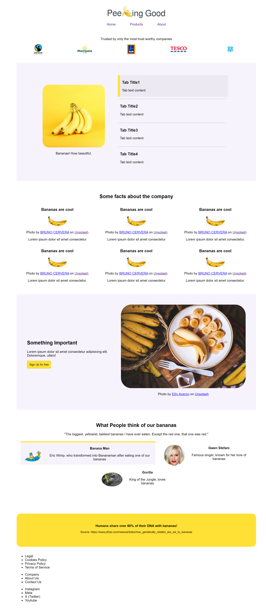
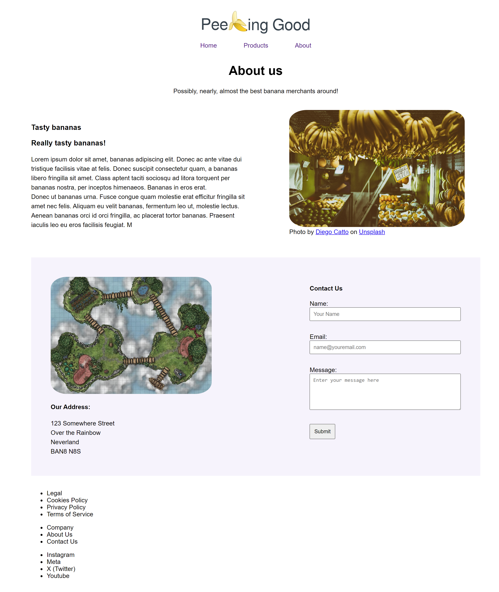
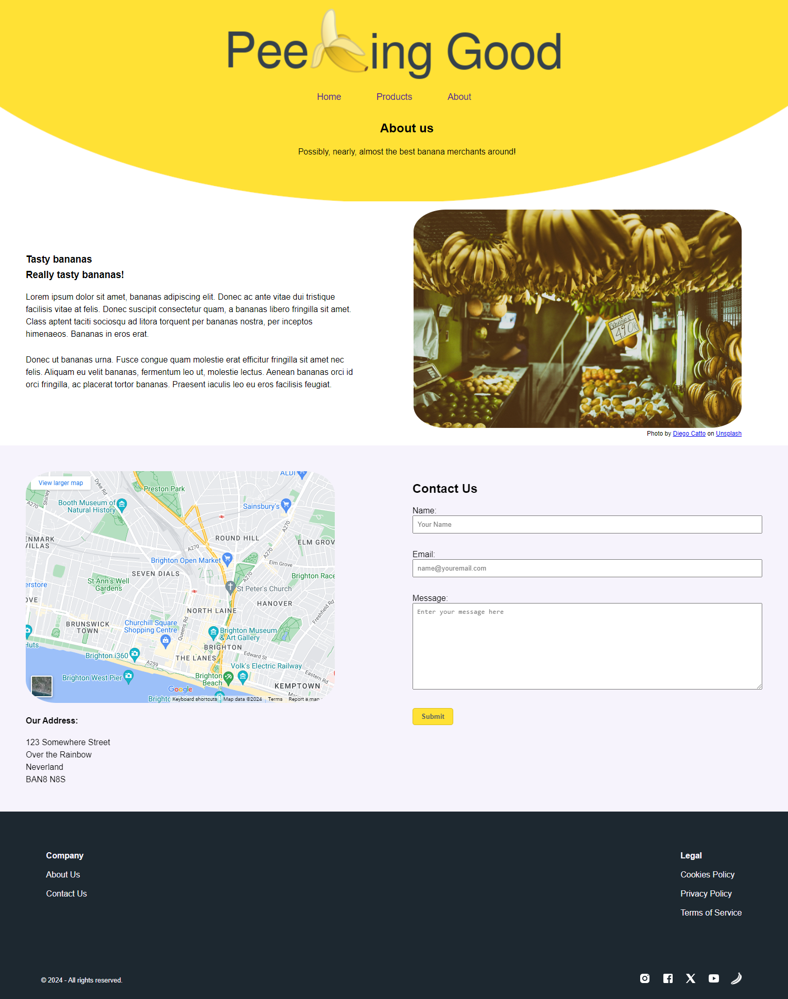
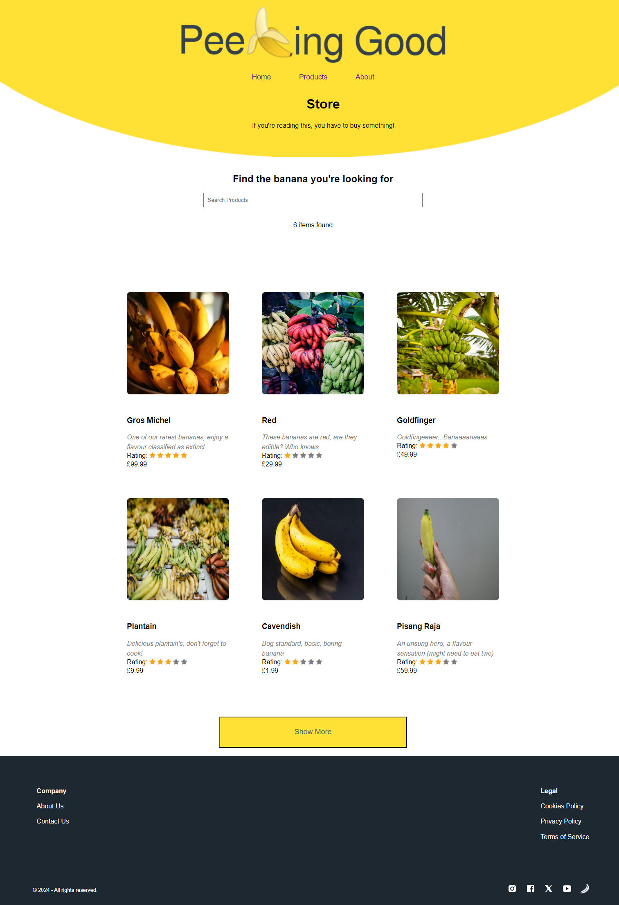

# Peeling Good Banana Merchants

This was the first group project completed while being a trainee web developer with TechNative academy.

# Our Dev Journey

## Our Process

We decided to allocate a page to each other. And split each page into multiple sections, which we called components. Each component got it’s own ticket on a trello board.

-   Index - Chloe
-   About - Conrad
-   Products - Seb

We decided to do this to allow each other a chance of working on HTML, CSS and JS. As well as reduce any conflicts in Git. This was our method until day 3, when we realised the index page required a lot of work. So we each took a section and improved it, based on each other's and Pete's feedback.
We layed some HTML boilerplate and a some Global CSS on the first day.

##  How we coordinated code updates and communicated

- We used trello to create a ticket system. 
- We made pull requests and put the link in slack, as well as updated the tickets. 
- Each morning we had a stand up talked about what to do, and kept up to date with each other throughout the day in slack. 
- In our PR we tried to include screenshots to show each other our changes.

## What went well? 
- We communicated well
- Improvement with Git workflow as project progressed.
- Good working on a page each
- Workload felt equally distributed, played to each others strengths and interests
- Chance to play around with everything we’ve learned so far
- Failing forward, improving through failure

## What didn’t go so well?
- Prettier formatting
- All of us accidentally committing to main
- Using global CSS selectors in individual page CSS
- Spending enough time considering mobile-first design to start.
- Had some git conflicts

## What we would do differently
- Configure prettier before writing any code
- Mobile-first
- Create more modular CSS, avoid having a large global.css file
- Potentially a live call during busier spells to quickly discuss issues
- Utilise JS classes for products instead of hard-coding into html

## What we have learnt
- Modular CSS can be a better choice
- Spend more time planning / mobile-first / organising file structure before starting coding
- Spend less time on optional items and make sure to complete essential items first 
- Trello is useful (If you don’t forget about it) 
- Git workflow isn’t so bad once you get used to it 

Day 1

On the first day, we were all in person. We were given a brief and a figma page with the website desgin. Our task was to create our own company and use the provided design to create our website!
So the first day included figuring out how were going to approach the task, where we came to the conclusion that we would split the 3 pages between us. 
We split the design into multiple sections we coined compartments, then layed the boiler plate HTML. We also created the global CSS file and put in the variables. 

Day 2

# How far we've got

## GHPages as of 5:18pm 18/04/2024

### Index

### Products

### About

# What you plan to do next

-   Footer
-   Hero
-   Responsive design
-   JS
-   Figure out the content (e.g images, text)
-   Finish by Friday

# Confidence levels

## Current

-   Conrad - 66.66%
-   Seb - confident but maybe not after js
-   Chloe - 90%

## To finish

-   Conrad - 100% for min requirement
-   Seb - 100% for min requirement
-   Chloe - 100% for min requirement

# Frustration levels!

-   Conrad - "I don't like the trello board"
-   Seb - "can be frustrating but will get used to it"
-   Chloe - "Conrad is mean to me about the bananas :("

# Things you've learned today

-   Lots about git workflow
-   logistics is 2/3rd of the work!
-   Responsive design is hard

# Any other thoughts!

-   Excited for tomorrow!!!
-   Excited for JS
-   Tired :(

Day 3

# How far we've got

## GHPages as of 4:30pm 19/04/2024

### Index

Working Tabs.

### Products

### About

Day 4

# How far we've got

## GHPages as of 4:30pm 19/04/2024

### Index

#### Desktop

#### Mobile

### Products

#### Desktop

#### Mobile

### About

#### Desktop

#### Mobile

